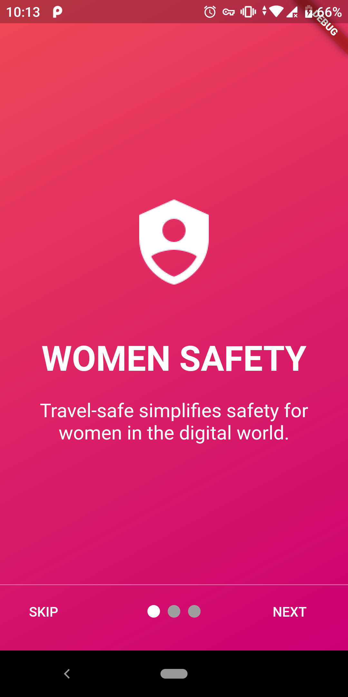

# Travel Safe
<!-- ALL-CONTRIBUTORS-BADGE:START - Do not remove or modify this section -->
[](#contributors-)
<!-- ALL-CONTRIBUTORS-BADGE:END -->
Being Concerned with the increasing brutality and insecurities faced by women during their travel, Despite of many Safety apps, none of them properly solves this problem.</br>
**Travel Safe**- A Flutter Application will help in preventing such instances and will promote safe and secure travel.</br>
If you think that your notable tech skills can help women of our country travel safely, Please be a part of Travel Safe and join our mission to make the world a safer place.

<p align="center">
</br></p>

# [Join our Slack Channel](https://join.slack.com/t/codingindiaorg/shared_invite/zt-ex48v3mq-nzfhMVbyPVflIkh2HC7POw)


## Getting Started
 This project is in the early stage of development. So anyone who is willing to Contribute can have a look at it . If you face any issue   or confusion while contributing , we will be happy to help you with it.

## How to Use 

**Step 1:**

Download or clone this repo by using the link below:

```https://github.com/codingindia/travel-safe.git```

**Step 2:**

Go to project root and execute the following command in console to get the required dependencies: 

``` 
flutter pub get 
```

**Step 3:**

You may find Folder `master` , it contains main codebase for the project. 
Go to the`master` folder and run the following command.

``` 
flutter run
```
You will be able to run the project Successfully with the help of these steps.

## Features

 - Share live location with a friend or in a group.
 - Panic Button to send the alarm to all the people with whom locations is being shared
 - Stop my Location Feature


### Technologies Used

## [Flutter](https://flutter.dev/) </br>
 Flutter is Google's SDK for crafting beautiful, fast user experiences for mobile, web and desktop from a single codebase. Flutter works   with existing code, is used by developers and organizations around the world, and is free and open source.

### Installation
 -   For [Windows](https://flutter.dev/docs/get-started/install/windows)
 -   For [MacOS](https://flutter.dev/docs/get-started/install/macos)
 -   For [Linux](https://flutter.dev/docs/get-started/install/linux)
 </br>

## [Firebase](https://firebase.google.com/)

### Folder Structure
Here is the core folder structure which flutter provides.

```
flutter-app/
|- android
|- assets/images
|- ios
|- lib
|- test
```

Here is the folder structure we have been using in this project

```
lib/
|- screens/
|- main.dart
```

Now, lets dive into the lib folder which has the main code for the application.

```
1- screens - This Contains all the screens which will be available in the App.
2- main.dart - This is the starting point of the application. All the application level configurations are defined in this file i.e, theme, routes, title, orientation etc.
```

### screens

This directory contains all the application level screens. A separate file is created for each screen.

```
screen/
|- introPage.dart
|- login.dart
|- maps.dart
|- register.dart
|- shared_location.dart
```
## ScreenShots
 <p align="center">



</p>
 
## How to Contribute
This is an Open Source project and we would be happy to see contributors who report bugs and file feature requests by submitting pull requests as well.This project adheres to the [Contributor Covenant](https://github.com/codingindia/travel-safe/blob/master/CONTRIBUTING.md). By participating, you are expected to uphold this code style. Please report issues here https://github.com/codingindia/travel-safe. While opening a new pull request or a new issue please adhere to [the pull request template](https://github.com/codingindia/travel-safe/blob/development/.github/ISSUE_TEMPLATE/pull_request_template.md), [bug report template](https://github.com/codingindia/travel-safe/blob/development/.github/ISSUE_TEMPLATE/bug_report_template.md) and [feature request template](https://github.com/codingindia/travel-safe/blob/development/.github/ISSUE_TEMPLATE/feature_request_template.md).

### Branch Policy
We have the following branches
 * **development**
     All development goes on in this branch. If you're making a contribution,
     you are supposed to make a pull request to _development_.

     It is advisable to clone only the development branch using the following command:

    `git clone -b <branch> <remote_repo>`

    Example:

    `git clone -b my-branch git@github.com:user/myproject.git`

    Alternative (no public key setup needed):

    `git clone -b my-branch https://git@github.com/username/myproject.git`

    With Git 1.7.10 and later, add --single-branch to prevent fetching of all branches. Example, with development branch:

    `git clone -b development --single-branch https://github.com/username/travel-safe `

 * **master**
   This contains the stable code. After significant features/bugfixes are accumulated on development, we move it to master.
   
 * [**Code Of Conduct**](https://github.com/codingindia/travel-safe/blob/development/CODE_OF_CONDUCT.md)
 </br>

## Conclusion

We will be happy to answer your queries that you may have on this approach, and if you want to lend a hand with the travel safe then please feel free to submit an issue and/or pull request 🙂

 If you liked this project, don’t forget to ⭐ star the repo to show your support.


## Contributors ✨

Thanks goes to these wonderful people ([emoji key](https://allcontributors.org/docs/en/emoji-key)):

<!-- ALL-CONTRIBUTORS-LIST:START - Do not remove or modify this section -->
<!-- prettier-ignore-start -->
<!-- markdownlint-disable -->
<table>
  <tr>
    <td align="center"><a href="https://github.com/ankitshaw"><br /><sub><b>Ankit Shaw</b></sub></a><br /><a href="#ideas-ankitshaw" title="Ideas, Planning, & Feedback">🤔</a> <a href="#maintenance-ankitshaw" title="Maintenance">🚧</a></td>
    <td align="center"><a href="https://www.xpertup.com"><br /><sub><b>Tanmay Rauth</b></sub></a><br /><a href="#ideas-tanmayrauth" title="Ideas, Planning, & Feedback">🤔</a> <a href="#maintenance-tanmayrauth" title="Maintenance">🚧</a></td>
    <td align="center"><a href="https://www.linkedin.com/in/rukmini-meda-28042916a/"><br /><sub><b>Rukmini Meda</b></sub></a><br /><a href="https://github.com/codingindia/travel-safe/commits?author=Rukmini-Meda" title="Code">💻</a></td>
    <td align="center"><a href="https://sourcerer.io/himanshusharma89"><br /><sub><b>HIMANSHU SHARMA</b></sub></a><br /><a href="https://github.com/codingindia/travel-safe/commits?author=himanshusharma89" title="Code">💻</a></td>
    <td align="center"><a href="https://sanxy.github.io/"><br /><sub><b>Yusuf Adefolahan</b></sub></a><br /><a href="https://github.com/codingindia/travel-safe/commits?author=sanxy" title="Code">💻</a></td>
    <td align="center"><a href="https://github.com/Nidakhan786"><br /><sub><b>Nida</b></sub></a><br /><a href="https://github.com/codingindia/travel-safe/commits?author=Nidakhan786" title="Documentation">📖</a></td>
    <td align="center"><a href="https://github.com/akshaysingh5"><br /><sub><b>Akshay </b></sub></a><br /><a href="https://github.com/codingindia/travel-safe/commits?author=akshaysingh5" title="Code">💻</a></td>
  </tr>
</table>

<!-- markdownlint-enable -->
<!-- prettier-ignore-end -->
<!-- ALL-CONTRIBUTORS-LIST:END -->

This project follows the [all-contributors](https://github.com/all-contributors/all-contributors) specification. Contributions of any kind welcome!